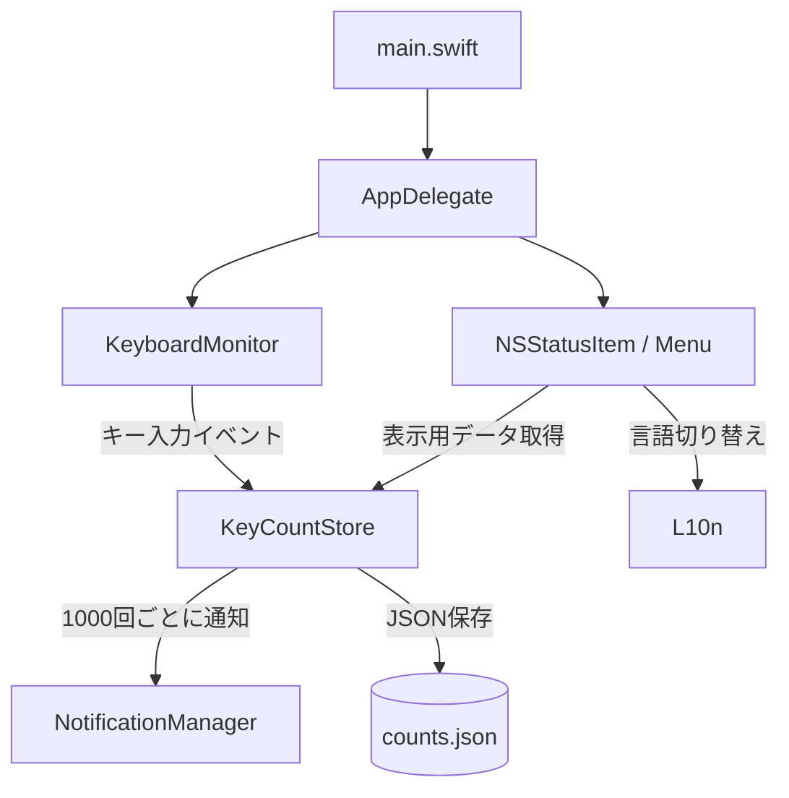

# アーキテクチャ

[English](Architecture.md) | 日本語

## 概要

KeyLens はイベント監視・データ管理・UI 制御の 3 つのレイヤーで構成されています。



---

## ファイル構成

```
262_MacOS_keyCounter/
├── Package.swift
├── build.sh
├── Resources/
│   └── Info.plist
└── Sources/KeyLens/
    ├── main.swift
    ├── AppDelegate.swift
    ├── KeyboardMonitor.swift
    ├── KeyCountStore.swift
    ├── NotificationManager.swift
    └── L10n.swift
```

---

## データフロー

```
キー押下
  |
  v
CGEventTap  （OS レベルのイベントフック）
  |  KeyboardMonitor.swift
  |  keyTapCallback()  <-- ファイルスコープのグローバル関数（@convention(c) 互換）
  |
  v
KeyCountStore.shared.increment(key:)
  |  serial DispatchQueue でスレッド安全
  |  counts[key] += 1
  |  dailyCounts[today] += 1
  |  scheduleSave()   <- 2 秒 debounce で書き込み
  |
  +-- count % 1000 == 0?
  |     YES -> DispatchQueue.main.async { NotificationManager.notify() }
  |
  v
（メニューを開いたとき）
NSMenuDelegate.menuWillOpen
  └─ KeyCountStore.{todayCount, totalCount, topKeys()}  -> メニュー再構築
```

---

## 各ファイルの役割

### [main.swift](Sources/KeyLens/main.swift)

エントリポイント。`NSApplication` を `.accessory` ポリシーで起動し、Dock に表示せずメニューバーのみに常駐させます。

```swift
app.setActivationPolicy(.accessory)
```

---

### [KeyboardMonitor.swift](Sources/KeyLens/KeyboardMonitor.swift)

`CGEventTap` を使ってシステム全体のキーダウンイベントを傍受します。

**設計上の重要事項 — `@convention(c)` 制約:**

`CGEventTapCallBack` は C 関数ポインタ型のため、変数をキャプチャする Swift クロージャは直接使えません。そのためコールバックはファイルスコープのグローバル関数として定義し、シングルトン（`KeyCountStore.shared` など）経由でのみ状態にアクセスします。

```
CGEvent.tapCreate(callback: keyTapCallback)
                            ^
                  グローバル関数（キャプチャなし）
                  -> @convention(c) に暗黙変換可能
```

**タップ復帰:** システムタイムアウトでタップが無効化（`.tapDisabledByTimeout`）された場合、コールバック内で即座に `CGEvent.tapEnable` で再有効化します。

キーコードからキー名への変換は `keyName(for:)` の静的ルックアップテーブルで処理します（US キーボードレイアウト）。

---

### [KeyCountStore.swift](Sources/KeyLens/KeyCountStore.swift)

カウントを管理し、ディスクへ保存するシングルトンです。

**スレッド安全:**

`CGEventTap` コールバックはメインスレッド外で動作します。serial `DispatchQueue` で辞書へのすべてのアクセスをシリアライズします。

```
CGEventTap スレッド           メインスレッド
      |                            |
  queue.sync { increment }    queue.sync { topKeys() }
      |  <-- シリアライズ -->       |
  scheduleSave()                   ...
      |
  queue.asyncAfter(+2 s) { save() }   <- debounce 書き込み
```

JSON は `.atomic` オプションで書き込み、ファイル破損を防ぎます。2 秒以内の連続書き込みは `DispatchWorkItem` のキャンセルで1回にまとめます。

---

### [NotificationManager.swift](Sources/KeyLens/NotificationManager.swift)

`UNUserNotificationCenter` でネイティブ通知を配信します。
`trigger: nil` は即時配信（スケジューリングなし）を意味します。
通知権限はシングルトンへの初回アクセス時にリクエストします。

---

### [AppDelegate.swift](Sources/KeyLens/AppDelegate.swift)

メニューバー UI とアクセシビリティ権限復帰を管理します。

**メニュー再構築の戦略:**
キー入力のたびにメニューを再構築するのは非効率です。代わりに `NSMenuDelegate.menuWillOpen` を使用し、ユーザーがメニューを開いたときだけ再構築します。メニューはステータス・統計・設定の3セクションに分割されています。

**権限復帰（多段構成）:**
1. `appDidBecomeActive` — ユーザーが任意のアプリに戻った瞬間に発火し、即座に `monitor.start()` を試みる
2. `schedulePermissionRetry()` — `AXIsProcessTrusted()` を 3 秒ごとにポーリング（フォールバック）
3. `setupHealthCheck()` — `monitor.isRunning` を 5 秒ごとに確認し、停止を検出したらリトライを開始

---

### [L10n.swift](Sources/KeyLens/L10n.swift)

ローカライズ文字列を一元管理するシングルトンです。English / 日本語 / システム自動検出をサポートし、言語設定は `UserDefaults` に保存されます。
