# Architecture

English

## Overview

KeyLens is built around three layers: event monitoring, data management, and UI control.

```mermaid
graph TD
    A[main.swift] --> B[AppDelegate]
    B --> C[KeyboardMonitor]
    B --> D[NSStatusItem / Menu]
    B --> I[StatsWindowController]
    B --> J[ChartsWindowController]
    B --> K[KeystrokeOverlayController]
    C -->|key event| E[KeyCountStore]
    C -->|keystrokeInput notification| K
    E -->|every 1000 presses| F[NotificationManager]
    E -->|JSON save| G[(counts.json)]
    D -->|fetch display data| E
    D -->|language switch| H[L10n]
    J -->|reads counts| E
    J --> L[ChartsView / KeyType]
    M[AIPromptStore] -->|currentPrompt| B
    M -->|reads language| H
```



---

## File structure

```
262_KeyLens/
├── Package.swift
├── build.sh
├── Resources/
│   └── Info.plist
└── Sources/KeyLens/
    ├── main.swift
    ├── AppDelegate.swift
    ├── KeyboardMonitor.swift
    ├── KeyCountStore.swift
    ├── KeyType.swift
    ├── NotificationManager.swift
    ├── StatsWindowController.swift
    ├── ChartsWindowController.swift
    ├── ChartsView.swift
    ├── KeystrokeOverlayController.swift
    ├── AIPromptStore.swift
    └── L10n.swift
```

---

## Data flow

```
Key press
  |
  v
CGEventTap  (OS-level event hook)
  |  KeyboardMonitor.swift
  |  keyTapCallback()  <-- file-scope global function (@convention(c) compatible)
  |
  +-- post Notification(.keystrokeInput)  --> KeystrokeOverlayController
  |
  v
KeyCountStore.shared.increment(key:)
  |  serial DispatchQueue for thread safety
  |  counts[key] += 1
  |  dailyCounts[today] += 1
  |  scheduleSave()   <- debounced 2 s write
  |
  +-- count % 1000 == 0?
  |     YES -> DispatchQueue.main.async { NotificationManager.notify() }
  |
  v
(on menu open)
NSMenuDelegate.menuWillOpen
  └─ KeyCountStore.{todayCount, totalCount, topKeys()}  -> rebuild menu
```

---

## File responsibilities

### [main.swift](Sources/KeyLens/main.swift)

Entry point. Launches `NSApplication` with `.accessory` policy so the app appears only in the menu bar, not in the Dock.

```swift
app.setActivationPolicy(.accessory)
```

---

### [KeyboardMonitor.swift](Sources/KeyLens/KeyboardMonitor.swift)

Intercepts system-wide key-down events via `CGEventTap`.

**Key design decision — `@convention(c)` constraint:**

`CGEventTapCallBack` is a C function pointer type, which means Swift closures that capture variables cannot be used directly. The callback is therefore defined as a file-scope global function and accesses state only through singletons (`KeyCountStore.shared`, etc.), which require no capture.

```
CGEvent.tapCreate(callback: keyTapCallback)
                            ^
                  global function (no captures)
                  -> implicitly convertible to @convention(c)
```

**Tap recovery:** If the tap is disabled by system timeout (`.tapDisabledByTimeout`), the callback immediately re-enables it via `CGEvent.tapEnable`.

Key code to name translation is handled by a static lookup table in `keyName(for:)` (US keyboard layout).

After translating a key name, the callback posts a `Notification(.keystrokeInput)` so `KeystrokeOverlayController` can display it without polling.

---

### [KeyCountStore.swift](Sources/KeyLens/KeyCountStore.swift)

Singleton that manages counts and persists them to disk.

**Thread safety:**

The `CGEventTap` callback runs outside the main thread. A serial `DispatchQueue` serialises all dictionary access.

```
CGEventTap thread             Main thread
      |                            |
  queue.sync { increment }    queue.sync { topKeys() }
      |  <-- serialised -->        |
  scheduleSave()                   ...
      |
  queue.asyncAfter(+2 s) { save() }   <- debounced write
```

JSON is written with `.atomic` to prevent file corruption. Consecutive writes within 2 seconds are coalesced into a single disk write via `DispatchWorkItem` cancellation.

---

### [KeyType.swift](Sources/KeyLens/KeyType.swift)

Classifies key names into categories (`letter`, `number`, `arrow`, `control`, `function`, `mouse`, `other`). Each case carries a `color` and a `label` used by `ChartsView` to colour-code bar segments.

---

### [NotificationManager.swift](Sources/KeyLens/NotificationManager.swift)

Delivers native notifications via `UNUserNotificationCenter`.
`trigger: nil` means immediate delivery (no scheduling).
Notification permission is requested on first singleton access.

---

### [StatsWindowController.swift](Sources/KeyLens/StatsWindowController.swift)

Displays a ranked table of all keys and mouse buttons with total and today's counts. Built with `NSTableView` (AppKit). Reloads from `KeyCountStore` each time the window is shown.

---

### [ChartsWindowController.swift](Sources/KeyLens/ChartsWindowController.swift) / [ChartsView.swift](Sources/KeyLens/ChartsView.swift)

`ChartsWindowController` wraps `ChartsView` (SwiftUI + Swift Charts) in an `NSHostingController`. `ChartDataModel` is an `ObservableObject` that pulls data from `KeyCountStore` on demand.

Four chart tabs:
- **Top 20 Keys** — horizontal bar coloured by `KeyType`
- **Daily Totals** — line chart of per-day keystroke counts
- **Key Categories** — donut chart of `KeyType` distribution
- **Top 10 per Day** — grouped bar chart of the top keys across recent days

---

### [KeystrokeOverlayController.swift](Sources/KeyLens/KeystrokeOverlayController.swift)

Floating `NSPanel` that shows the last N keystrokes in real time using a SwiftUI `OverlayView`. Listens for `Notification(.keystrokeInput)` posted by `KeyboardMonitor`. The panel fades out after 3 s of inactivity using a debounced `DispatchWorkItem`. Toggle state is persisted in `UserDefaults`.

---

### [AIPromptStore.swift](Sources/KeyLens/AIPromptStore.swift)

Singleton that stores and retrieves the AI analysis prompt. Built-in defaults exist for English and Japanese. User edits are persisted in `UserDefaults` keyed by language, so each language retains an independent prompt.

---

### [AppDelegate.swift](Sources/KeyLens/AppDelegate.swift)

Manages the menu bar UI and accessibility permission recovery.

**Menu rebuild strategy:**
Rebuilding the menu on every keystroke is wasteful. Instead, `NSMenuDelegate.menuWillOpen` is used to rebuild only when the user actually opens the menu. The menu is split into three sections: status, stats, settings.

**Permission recovery (layered):**
1. `appDidBecomeActive` — fires when the user switches back to any app; attempts `monitor.start()` immediately
2. `schedulePermissionRetry()` — polls `AXIsProcessTrusted()` every 3 s as a fallback
3. `setupHealthCheck()` — checks `monitor.isRunning` every 5 s and triggers retry if stopped

---

### [L10n.swift](Sources/KeyLens/L10n.swift)

Centralised localisation singleton. Supports English, Japanese, and system auto-detection. Language preference is persisted in `UserDefaults`.

### Data Dir.

~/Library/Application Support/KeyLens/ 
