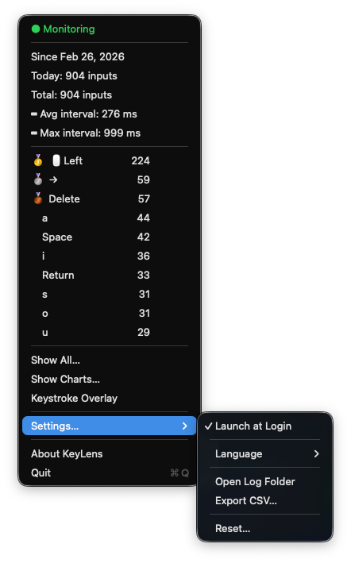

# KeyLens

[English](README.md) | 日本語

<div align="center">

[](https://github.com/etalli/262_KeyLens/releases/latest)


[](https://github.com/etalli/262_KeyLens/releases/latest)

**macOS メニューバー常駐型のキーストローク・マウスクリック監視・記録アプリ**



</div>

---

## 機能

- **グローバル監視** — アクティブなアプリに関係なく、すべてのキー入力とマウスクリックをカウント
- **マウスクリック計測** — 左・右・中ボタンおよびサイドボタンを個別にカウント
- **メニューバー統計** — 本日のカウント・累計・平均入力間隔・最小入力間隔（最速バースト）・Top 10 を表示
- **全件表示** — すべてのキー・マウスボタンを累計／本日別にランキング表示するウィンドウ
- **グラフ表示** — 4 種類のインタラクティブなグラフ：Top 20 キー（横棒）、日別合計（折れ線）、キー分類（ドーナツ）、日別 Top 10（グループ棒グラフ）
- **CSV 書き出し** — サマリーと日別明細を 2 ファイルに書き出し、保存先フォルダを指定
- **データをコピー** — `counts.json` をカスタマイズ可能な AI プロンプト付きでクリップボードにコピー、そのまま AI に貼り付けて分析
- **AI プロンプト編集** — **設定… > AI プロンプトを編集…** でプロンプトを編集、言語ごとに保存
- **キーオーバーレイ** — ⌘C / ⇧A 形式で最近のキー入力をリアルタイム表示、3 秒で自動フェードアウト
- **マイルストーン通知** — キー／ボタンごとに 1,000 回ごとにネイティブ通知
- **多言語 UI** — English / 日本語 / システム自動検出
- **権限復帰の即時対応** — アクセシビリティ権限付与後、自動でモニタリングを再開

---

## クイックインストール

1. **[KeyLens.dmg](https://github.com/etalli/262_KeyLens/releases/latest)** をダウンロード
2. DMG を開き、**KeyLens.app** を `/Applications` にドラッグ
3. アプリを起動 — プロンプトが表示されたら **アクセシビリティ** 権限を許可

> **注意:** アプリは ad-hoc 署名を使用しており、個人利用を想定しています。初回起動時に Gatekeeper の警告が出る場合は、アプリを右クリックして **「開く」** を選択してください。

---

## 動作環境

| 項目 | 要件 |
|------|------|
| macOS | 13 Ventura 以降 |
| Swift | 5.9 以降（Xcode 15 付属） |
| 権限 | アクセシビリティ（初回起動時にプロンプト表示） |

---

## ソースからビルド

```bash
./build.sh            # App Bundle のみ作成
./build.sh --run      # ビルド後にそのまま起動
./build.sh --install  # ビルド → インストール → codesign → TCC リセット → 起動  ← 推奨
./build.sh --dmg      # 配布用 DMG を作成
```

> 必ず `build.sh` を使用してください — `swift build` 単体では通知機能が動作しません。

<details>
<summary><code>--install</code> の手順</summary>

| ステップ | 内容 |
|----------|------|
| `cp -r KeyLens.app /Applications/` | `/Applications` にインストール |
| `codesign --force --deep --sign -` | ad-hoc 署名（アクセシビリティ権限を安定化） |
| `pkill -x KeyLens` | 旧プロセスを停止してからバイナリを差し替え |
| `tccutil reset Accessibility <bundle-id>` | 古いバイナリハッシュの TCC エントリを削除 |
| `open /Applications/KeyLens.app` | 新しいビルドを起動 |

**TCC リセットが必要な理由:** macOS はアクセシビリティ権限をバイナリのハッシュ単位で管理しています。`swift build` のたびに新しいバイナリが生成されるため、古い TCC エントリが陳腐化します。リセットしないと、システム設定でトグルが ON になっていても `AXIsProcessTrusted()` が `false` を返し続けます。

</details>

<details>
<summary>ログ確認</summary>

```bash
tail -f ~/Library/Logs/KeyLens/app.log
```

</details>

---

## アクセシビリティ権限

権限がない場合、初回起動時にアラートが表示されます。

1. **「システム設定を開く」** をクリック
2. **プライバシーとセキュリティ → アクセシビリティ** に移動
3. **KeyLens** を有効化
4. 任意のアプリに戻る — モニタリングが即座に再開

**権限復帰の仕組み（多段構成）:**

| トリガー | 復帰までの時間 |
|----------|---------------|
| アプリがアクティブになる（`didBecomeActiveNotification`） | ほぼ即時 |
| 権限リトライタイマー | 3 秒ごと |
| ヘルスチェックタイマー | 5 秒ごと |

---

## セキュリティ

| | 詳細 |
|---|---|
| **記録する** | キー名（例: `Space`, `e`）・マウスボタン名と押下回数のみ |
| **記録しない** | 入力テキスト・パスワード・クリップボードの内容・マウスカーソルの位置 |
| **保存先** | ローカル JSON ファイルのみ — ネットワーク送信なし |
| **イベントアクセス** | `.listenOnly` タップ — 読み取り専用、キー入力の改ざん・注入は不可 |

<details>
<summary>リスク一覧</summary>

| 項目 | リスク | 本アプリでの対策 |
|------|--------|----------------|
| グローバルキー監視 | 高（権限の性質上） | `.listenOnly` + `tailAppendEventTap` — 受動的リッスンのみ |
| データの内容 | 低 | キー名＋カウントのみ。入力文字列の再構築は不可能 |
| データファイル | 中 | 無暗号化。同一ユーザーの他プロセスが読める |
| ネットワーク | なし | 外部通信は一切なし |
| コード署名 | 中 | ad-hoc のみ。他ユーザーへの配布は Gatekeeper がブロック |

</details>

---

## データファイル

```
~/Library/Application Support/KeyLens/counts.json
```

メニューの **設定… → 保存先を開く** でフォルダを Finder で開けます。

---

内部設計の詳細は [Architecture.md](docs/Architecture.md) を参照してください。


フィードバック歓迎! バグ報告、機能要望、あるいは単純な質問など、何でも気軽に Issue を立ててください。あなたからの投稿をお待ちしています!!
