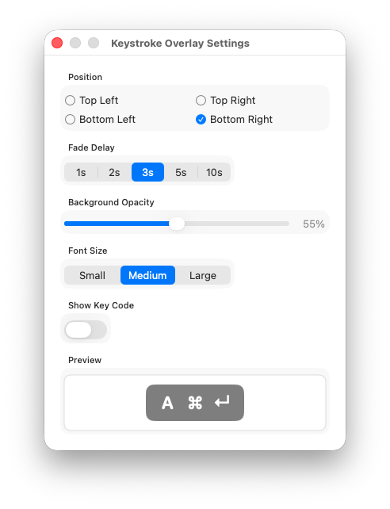

# KeyLens

English | [日本語](docs/README.ja.md)

<div align="center">

[](https://etalli.github.io/262_KeyLens/landing-page/index.html)
[](https://github.com/etalli/262_KeyLens/releases/latest)


[](https://github.com/etalli/262_KeyLens/releases/latest)

**Optimize your keyboard layout with real-world typing data.**

KeyLens is a powerful macOS tool that analyzes your typing habits locally to recommend ergonomic layout improvements tailored specifically to your usage patterns.

[**Visit the Official Landing Page**](https://etalli.github.io/262_KeyLens/landing-page/) for a visual tour and deep dive into the optimization engine.

<table>
  <tr>
    <td></td>
    <td align="center"><i>Menu Bar</i></td>
    <td></td>
    <td align="center"><i>Heatmap</i></td>
  </tr>
</table>
</div>

---

## Features

- **Global recording** — Counts all keystrokes regardless of the active application
- **Menu bar statistics** — Today's count, total count, average keystroke interval; customizable display (toggle and reorder widgets)
- **Charts** — Keyboard Heatmap, Top Keys, Bigrams, Apps, Devices, Daily Totals, Ergonomic Learning Curve, Weekly Delta Report, and more
- **Keystroke Overlay** — Real-time floating window showing recent keystrokes (⌘C / ⇧A style)

---

## Quick Install

1. Download **[KeyLens.dmg](https://github.com/etalli/262_KeyLens/releases/latest)** (or the ZIP version from the release page)
2. Open the DMG and drag **KeyLens.app** to `/Applications`
3. **Important (Security):** On first launch, macOS will block the app as it is from an "unidentified developer". Run the following command in Terminal:

   ```bash
   sudo xattr -rd com.apple.quarantine /Applications/KeyLens.app
   ```

   Then launch the app normally from Finder or Spotlight.
4. An alert will appear asking for **Accessibility** permission.
   - Click **Open System Settings** → **Privacy & Security > Accessibility** → enable **KeyLens**.
5. Switch back to any app — the keyboard icon appears in your menu bar and monitoring starts.

> **Note:** The app uses an ad-hoc signature. This manual override is required only once.

---

## How to Use

### Menu bar

Click the keyboard icon (⌨) in the menu bar to open the panel.

| Item | Description |
|------|-------------|
| **Today / Total** | Keystroke count for today and all time |
| **Avg interval** | Running average time between keystrokes (ms) |
| **Top keys** | Most-pressed keys with counts |
| **Top app today** | Frontmost application with the most keystrokes today |
| **Show All** | Opens a ranked table of every key and mouse button |
| **Charts** | Opens the full analytics window |
| **Overlay** | Toggles the real-time keystroke overlay |
| **Settings…** | Customize Menu display, language, notifications, reset, export CSV, open log folder |

### Charts window

Open via **Charts** in the menu. Sections (scroll down):

| Section | What it shows |
|---------|---------------|
| **Keyboard Heatmap** | Physical key layout coloured by frequency or ergonomic strain; toggle layout template (ANSI / Pangaea / Ortho) and click a key to see the exact value |
| **Top 20 Keys** | Horizontal bar chart coloured by key type |
| **Top 20 Bigrams** | Most frequent consecutive key pairs; same-finger rate and hand alternation summary |
| **Daily Totals** | Line chart of per-day keystroke counts |
| **Ergonomic Learning Curve** | Same-finger rate, hand alternation rate, high-strain rate over time |
| **Weekly Delta Report** | Last 7 days vs prior 7 days — keystrokes and ergonomic rates with trend arrows |
| **Key Categories** | Donut chart of key-type distribution |
| **Keyboard Shortcuts** | Top modifier+key combinations |
| **Apps** | Per-application keystroke bar charts (all-time and today) and ergonomic score table |
| **Devices** | Per-device keystroke bar charts (all-time and today) and ergonomic score table |

### AI Analysis

Export your keystroke data and analyze it with an AI assistant for layout optimization advice.

1. Open **Settings… > Data > Export CSV** to export your keystroke data as a CSV file
2. Open **Settings… > Data > Edit AI Prompt** to review or customize the analysis prompt
3. Copy the exported CSV content and paste it into an AI tool (e.g. Claude, ChatGPT) together with the prompt

**Example prompt workflow:**

```
[Paste the built-in prompt]

Here is my keystroke data:
[Paste CSV content]
```

The default prompt asks the AI to compute same-finger rates, hand alternation rates, bigram/trigram frequencies, and recommend thumb-key assignments for a split keyboard.

---

### Keystroke Overlay

<table>
  <tr>
    <td></td>
    <td></td>
  </tr>
  <tr>
    <td align="center">Setting</td>
    <td align="center">Example</td>
  </tr>
</table>
</div>

Toggle via **Overlay** in the menu. Shows recent keystrokes in a floating window that fades after 3 seconds of inactivity. Position and size are configurable via the gear icon (⚙).

---

## Security

| | Details |
|---|---|
| **Records** | Key names (e.g. `Space`, `e`) and mouse button names with press counts only |
| **Does NOT record** | Typed text, sequences, passwords, clipboard content, or cursor position |
| **Storage** | Local JSON file only — no network transmission |
| **Event access** | `.listenOnly` tap — read-only, cannot inject or modify keystrokes |

<details>
<summary>Full risk summary</summary>

| Area | Risk | Mitigation |
|------|------|------------|
| Global key monitoring | High (by nature) | `.listenOnly` + `tailAppendEventTap` — passive only |
| Data content | Low | Key name + count only; typed text cannot be reconstructed |
| Data file | Medium | Unencrypted; readable by any process running as the same user |
| Network | None | No outbound connections |
| Code signing | Medium | Ad-hoc only; Gatekeeper blocks distribution to other users |

</details>

---

## Data file

```
~/Library/Application Support/KeyLens/counts.json
```

Use **Settings… > Open Log Folder** to open the directory in Finder. See [Architecture](docs/Architecture.md) for the schema.

---

## Build from Source

See [Architecture — Build & Test](docs/Architecture.md#build--test).

---

For internal design details, see [Architecture](docs/Architecture.md).
For the development roadmap, see [Roadmap](docs/Roadmap.md).

Feedback welcome! Feel free to open an [issue](https://github.com/etalli/262_KeyLens/issues) for bug reports, feature requests, or questions.
